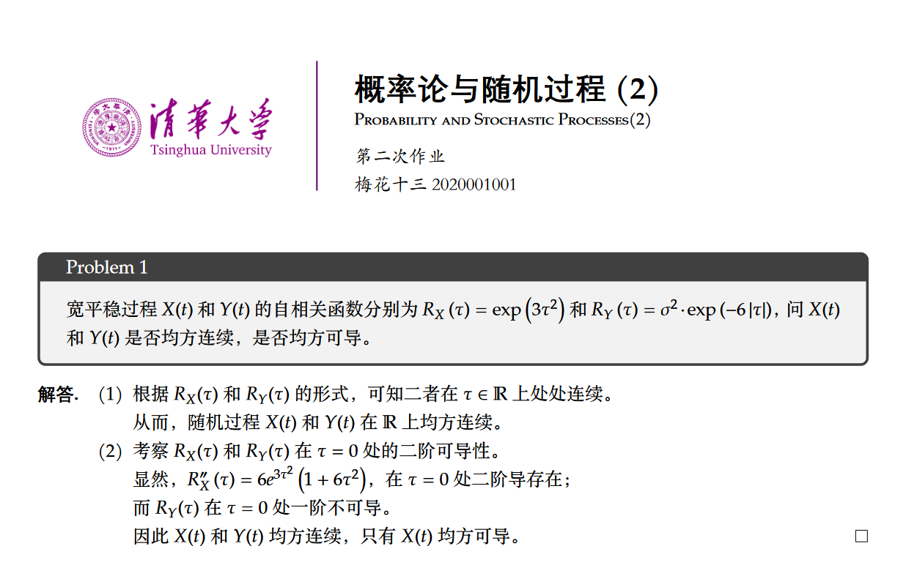

# LaTeX Templates

## Basic Info

This is a repo of latex template(s) for my daily homework and lab report, and the template is right suitable for **Tsinghua University** students.

I'm new in latex, and I'm trying to beautify this template so that it is comfortable for me to write and think. For now in fact, I have not designed many things, so I expect it to be something like a little **repository**, for it may not help so many people to get what you like. But I will keep studying and try to make it better. :-)

Welcome all the precious advice & guidance! I'm always ready to make my homework more elegant and well-looking!

---

## Something the template has for now...

1. Title design (I think I'm fond of this style for now, but maybe I'll change my mind :-) )
   * could be used directly by `\maketitle`
   * `\title` is **just** the title (fine, it can not be any other thing.), such as '**第一次课后作业**';
     * default font type is set to Chinese
   * `\class` could be the name of the class, such as '**微积分A**';
     * default font type is set to Chinese
   * `\engname` is the class name in English, such as '**Computer Networks**';
   * `\author` is the name of you / your team;
     * default font type is set to Chinese
   * `\id` is your Student ID number, such as **20200001**.
2. Section design
   * (maybe not suitable for the word 'design', in fact, there is not something brand-new)
   * just using `\section` and `\subsection` normally is fine.
3. Color-box Problem
   * use `\begin{colorpb}` to enjoy a box with auto counter number, and just type somthing in it.
   * you can put the problem into it.
4. Answer
   * use `\begin{answer}` to type your answer.
   * the default beginning is set to '解答.' so you can just change it to whatever you like.

## Prerequisites

Something you might need to pre-install:

- Code font: **JetBrains Mono;**
- Chinese main font: **华文楷体、等线、方正新书宋简体;**
- Image of your univ. or anything you would like;
  - change the path below;
  - "% set title format ... includegraphics[height=1.5cm]{``YOUR PATH``}"

---

## Some tips

If you are searching for a logo in `svg` or `png` format, you can check this website for free. It's worth highly recommendation: [LOGO wine](https://www.logo.wine/ "a free logo website") .

And for the Chinese font, I got my candy from this website: [方正字库官网](https://www.foundertype.com/ "方正字体") . And it is free to use personally, too.

Feel free to give suggestions or help if you have any better ideas!
